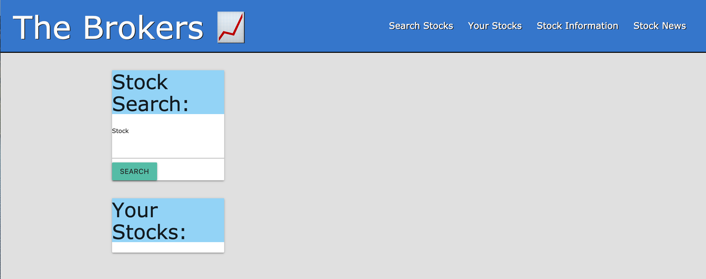
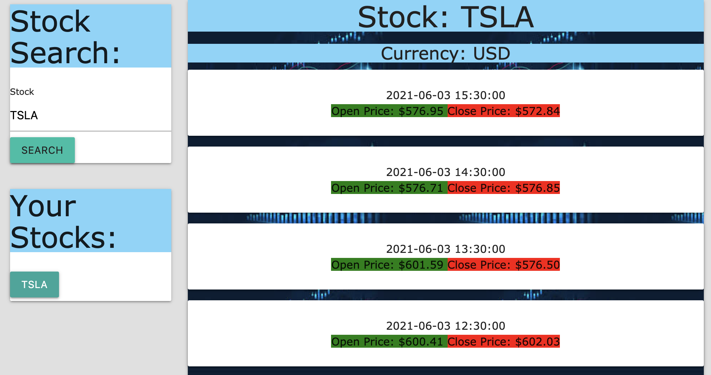
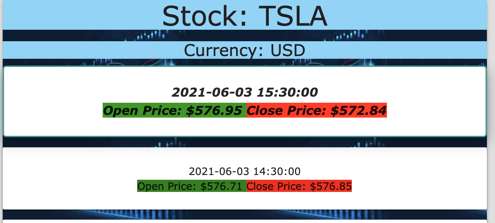
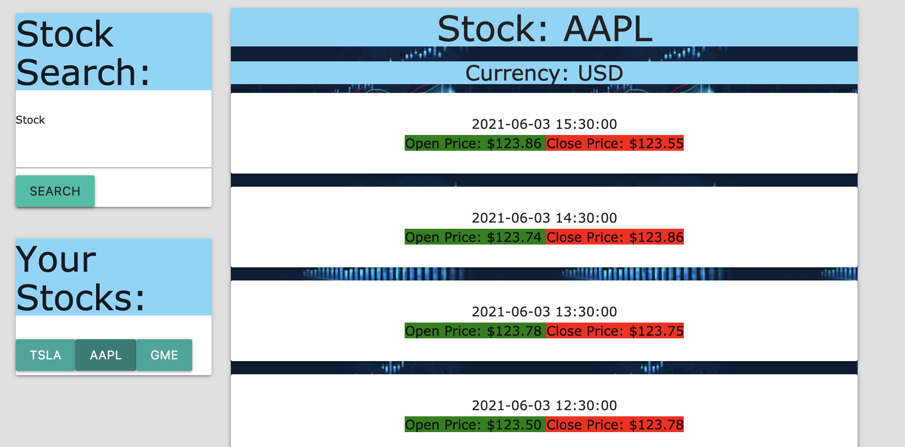
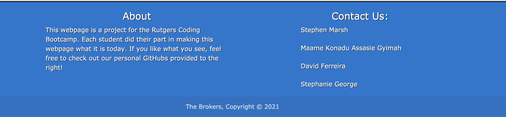

# The Brokers

## Description 

Interest in stocks has gain mainstream popularity recently thanks to the subreddit WallStreetBets, the scandal circulating around Robinhood,  and the uncertainty of market volatility. Stocks have peaked the interests of both young and old inexperienced but curious investors. We offer a solution with simplicity in mind. 

We are not financial advisors, we are The Brokers. 

A group of four young developers created an application that allows the user to gain instant information regarding a stock with relevant news information. We believe the user should have all the available information in one simple application to make their own informed financial decision. 

We wanted to create an applcation that will allow prospective investors to have all the tools readily available to make their own informed stock investment decisions. 

Checkout [THE BROKERS!:chart_with_upwards_trend:](https://imaparadox.github.io/The-Brokers/)

## Table of Contents 

* [Technologies Used](#technologies-used)
* [Usage](#usage)
* [Contributions](#contributions)
* [License](#license)

## Technologies Used

* JavaScript
* JQuery
* Materalize
* Twelve Data API
* Polygon.io API
* Favicon

## Usage 

When you first website you are presented with a simple layout where you can search for any stock you'd like:

Upon entering the stock ticker, you will be shown relevant stock information, as well as prior opening and closing prices of the stock in one-hour intervals:

Hovering over a stock price will make the text pop out and allow for easier readability

By simply using the navigation bar on top of the website you can quickly jump to the news articles associate with the stock ticker you just looked up!

Hovering over the news articles will dynamically change the container

Clicking on the article will open up the article in a separate tab for you to read more in depth about the stock!

As you search for more and more stocks, a list of your recently searched stocks will be displayed for easy access!

As you build your stock watchlist, clicking on one of the saved stocks will display current stock information and news articles so you're always up to date!

Finally, at the bottom of our application, you will find a small section dedicated to the four developers of this application:computer:.

## Contributions

* [Stephen Marsh](https://github.com/Imaparadox)
* [Maame Konadu Assasie Gyimah](https://github.com/maa-hub)
* [David Ferreira](https://github.com/DiSantoz)
* [Stephanie George](https://github.com/stephgeorge22)

## License

MIT License

© 2021 The Brokers Inc.

Permission is hereby granted, free of charge, to any person obtaining a copy
of this software and associated documentation files (the "Software"), to deal
in the Software without restriction, including without limitation the rights
to use, copy, modify, merge, publish, distribute, sublicense, and/or sell
copies of the Software, and to permit persons to whom the Software is
furnished to do so, subject to the following conditions:

The above copyright notice and this permission notice shall be included in all
copies or substantial portions of the Software.

THE SOFTWARE IS PROVIDED "AS IS", WITHOUT WARRANTY OF ANY KIND, EXPRESS OR
IMPLIED, INCLUDING BUT NOT LIMITED TO THE WARRANTIES OF MERCHANTABILITY,
FITNESS FOR A PARTICULAR PURPOSE AND NONINFRINGEMENT. IN NO EVENT SHALL THE
AUTHORS OR COPYRIGHT HOLDERS BE LIABLE FOR ANY CLAIM, DAMAGES OR OTHER
LIABILITY, WHETHER IN AN ACTION OF CONTRACT, TORT OR OTHERWISE, ARISING FROM,
OUT OF OR IN CONNECTION WITH THE SOFTWARE OR THE USE OR OTHER DEALINGS IN THE
SOFTWARE.

